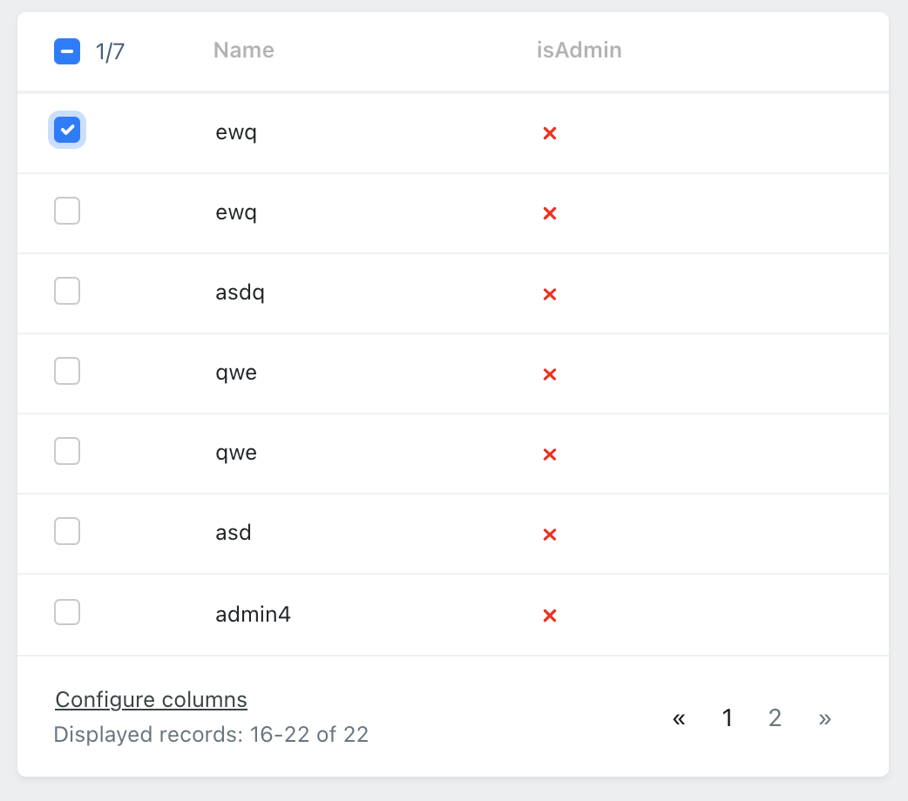

# OrchidTables

[![Latest Version on Packagist][ico-version]][link-packagist]
[![Total Downloads][ico-downloads]][link-downloads]
[![Build Status][ico-travis]][link-travis]
[![StyleCI][ico-styleci]][link-styleci]
[](https://github.com/lintaba/orchid-tables/actions/workflows/php.yml)

An opinionated extension package for [Laravel Orchid](orchid) to extend its table handling capabilities, and some
further useful helper methods.

## Installation

Via Composer

``` bash
$ composer require lintaba/orchid-tables
```

## Usage

This package adds the following new shiny things:

- [Checklist td](#TdChecklist) - Checklist for tables
- [TD/Field/Layout::can, canAll](#can) - permission-based visibility for fields, columns, layouts
- [Layout::html()](#layoutHtml) - raw html for layouts
- TD extensions:
  -  [date](#td-date)
  -  [num](#td-num)
  -  [limit](#td-limit)
  -  [bool](#td-bool)
  -  [keyValues](#td-keyValues)
  -  [link](#td-link)
  -  [renderable](#td-renderable)
  -  [rowClass](#td-rowClass)
  -  [rowLink](#td-rowLink)
- [TableAdvanced](#tableAdvanced) - Formattable, clickable table rows
- [QuickExport](#QuickExport) - Export datatables within seconds

### <a name="TdChecklist"></a>Screen\TdChecklist

Checklist with select-all support. Can select range by pressing `shift`.



Usage:

```php
use Lintaba\OrchidTables\Screen\TDChecklist;

class UserTable extends Table {
//...
    public function columns(): array
    {
        return [
            TDChecklist::make(),
            //...
            TD::make('id'),
        ];
    }
}
```

`TDChecklist::make($name = 'checkbox')`

`->checkboxSet(key,value)`

and almost everything available thats available on `TD`.

Without further configuration it sends the following:

```post
checkbox[] = 1
```

The provided collection's items must have a `getKey():int|string` method, which provides the value for the checkbox.

By default the checklist belongs to the main form, which is linked to most of the action buttons, therefore having
a `Button` within `Screen@commandBar()` will send the selection list too. However the modals are having their own forms,
so it will not be included there. Currently only one form is supported. (Feel free to open a ticket if you need support for multiple forms/modals.)

Changing the form of the list to a modal:

```php
class UserTable extends Table {
//...
    public function commandBar(): array {
        return [
            ModalToggle::make("my modal")->modal('myModal'),
        ];
    }
    public function columns(): array {
        return [
            TD::Checklist::make()->checkboxSet('form','screen-modal-form-myModal'),
        ];
    }
```  

Redirecting back with error/success can keep the current selection:

```php
class UserScreen extends Screen {
//...
    public function activateUsers(Request $request){
        Alert::message('Selected item count is still ' . count($request->get('checkbox', []) ) );
        $request->flash();
    }
```

### <a name=can></a> Can mixins:

These are mixed into most of the orchid's makeable and visible things.
- `TD`
- `Field`
- `LayoutFactory`

#### can(string[] $permissions...) 

Hides the field if the current user has none of the listed permissions.

Shows only if a previous `canSee` didn't hide it, and if **any** of the listed permissions are given to the user.

#### canAll(string[] $permissions...)

Hides the field if the current user has none of the listed permissions.

Shows only if a previous `canSee` didn't hide it, and if **all** of the listed permissions are given to the user.

> Both `can` and `canAll` internally usese `canSee`, so chaining another `canSee` after a `can` will invalidate the permission check.

> Using a non-existing permission throws an easily fixable exception during development mode, to help avoid bugs.

### Layout mixins:

#### <a name="layoutHtml"></a> html
```php
html(string|callable $content): self
```

Makes a `Layout` component, that renders the provided html string (or the value of it, when its a closure.) 

### Cell mixins:

#### <a name="td-date"></a> date
```php
date(bool $withHumanReadable = true, string $format = null): self
```

Formats a date string or carbon date to human readable.
Format defaults to `config('orchid-tables.date_format')`,  `config('app.date_format')`, or `Y?-m-d H:i`. (omits year if its the current year.)

#### <a name="td-num"></a> num

```php
num(int $decimals = 0,
        string $suffix = null,
        string $decimalSeparator = ',',
        string $thousandsSeparator = DataHelpers::NBSP): self
```

Formats a numeric value to a more readable / convinient format.
 - Sets the decimals
 - May add a suffix, delimitered with a non-breakable space (nbsp), which guaranteed not to be broken to multiple lines.
 
*example:*
```php
TD::make('size')->num(2,'m²')
```

 
#### <a name="td-limit"></a> limit
```php
limit(int $max = 100, string $end = '...')
```

Keeps the text under the given maximum character count. If its longer, replaces the end with ... (or anything specified in `end`). 


#### <a name="td-bool"></a> bool() 

Shows a green tick, or a red cross, depending on if the column's value has a truthy or falsy value.

| Truthy                                                                                                                                                                                                                                                                                                                                                                                                                                                                                                                                                                 | Falsy                                                                                                                                                                                                                                                                                                                                                                                                                                                                 |
|------------------------------------------------------------------------------------------------------------------------------------------------------------------------------------------------------------------------------------------------------------------------------------------------------------------------------------------------------------------------------------------------------------------------------------------------------------------------------------------------------------------------------------------------------------------------|-----------------------------------------------------------------------------------------------------------------------------------------------------------------------------------------------------------------------------------------------------------------------------------------------------------------------------------------------------------------------------------------------------------------------------------------------------------------------|
| <svg version="1.1" xmlns="http://www.w3.org/2000/svg" width="32" height="32" viewBox="0 0 32 32"> <path fill="green" stroke="green" d="M16 0c-8.836 0-16 7.163-16 16s7.163 16 16 16c8.837 0 16-7.163 16-16s-7.163-16-16-16zM16 30.032c-7.72 0-14-6.312-14-14.032s6.28-14 14-14 14 6.28 14 14-6.28 14.032-14 14.032zM22.386 10.146l-9.388 9.446-4.228-4.227c-0.39-0.39-1.024-0.39-1.415 0s-0.391 1.023 0 1.414l4.95 4.95c0.39 0.39 1.024 0.39 1.415 0 0.045-0.045 0.084-0.094 0.119-0.145l9.962-10.024c0.39-0.39 0.39-1.024 0-1.415s-1.024-0.39-1.415 0z"></path></svg> | <svg width="32" height="32" xmlns="http://www.w3.org/2000/svg" viewBox="0 0 32 32"><path fill="red" stroke="red" d="M18.8,16l5.5-5.5c0.8-0.8,0.8-2,0-2.8l0,0C24,7.3,23.5,7,23,7c-0.5,0-1,0.2-1.4,0.6L16,13.2l-5.5-5.5  c-0.8-0.8-2.1-0.8-2.8,0C7.3,8,7,8.5,7,9.1s0.2,1,0.6,1.4l5.5,5.5l-5.5,5.5C7.3,21.9,7,22.4,7,23c0,0.5,0.2,1,0.6,1.4  C8,24.8,8.5,25,9,25c0.5,0,1-0.2,1.4-0.6l5.5-5.5l5.5,5.5c0.8,0.8,2.1,0.8,2.8,0c0.8-0.8,0.8-2.1,0-2.8L18.8,16z"></path></svg> |

#### <a name="td-keyValues"></a> keyValues()
```php
keyValues(int $maxDepth = 3)
```

Shows a key-value structure (using `dl/dt/dd`) of a complex object / array / json entry.

Limits max depth, by default to 3.


#### <a name="td-link"></a> link($href, $segments = null)

Makes a link/button to the target location.
Both `$href` and `$segments` can be a closure, or a value.

Example:
```php
// article: { user: { id: 42, first: "John", last: "Doe", __toString:"John Doe" } }
TD::make('user')->link(function(User $user){return route('user.show',$user->id)}),
//<a href="/users/show/42">John Doe</a>

TD::make('user')->link('user.create',['last','first'])
//<a href="/users/show/42">Doe<br> John</a>

```
 
#### <a name="td-renderable"></a> renderable()

Tries to render a model, using one of the following:
 - its value, when its a scalar or null
 - as a `Personable` `Persona`
 - `->presenter()` to get a `Personable` `Persona`
 - value from `->display()`
 - its `name`, `slug`, or `class@id` as last resort.

### Formatted exportable cells

These helper methods are useful with formatted excel exports.
By default its not activated, as it adds an extra overhead, which is usually not being used. To activate, you can either set it up in the configuration:
```php
# config/orchid-tables.php
        'cell'   => Mixins\CellExportFormattableMixin::class,
```
or call the following:
```php
\Lintaba\OrchidTables\Facades\OrchidTables::mixinTdExportFormattables();
```

Augmented methods:
* `date`
  * Formatted as date
* `num`
  * Formatted as the provided number format, but stored as a number. 
* `keyValues`
  * Stored as json in the output

Furthermore the following helper methods are available:

####notExportable($notExportable = true): self
Sets a column to be non-exported.
> Its advised to set it on ie. action buttons. 

####setStyle($style): self

A callback that formats the given row, or the actual formatting. Can be called multiple times, and the result will be merged. Callback can either return with a phpexcel formatted array, or one (or multiple merged together) from the followings:
* `ExportStyles::FORMAT_NONE`
* `ExportStyles::FORMAT_TEXT`


* `ExportStyles::FORMAT_HUF`
* `ExportStyles::FORMAT_USD`
* `ExportStyles::FORMAT_EUR`
* `ExportStyles::FORMAT_PCS`


* `ExportStyles::FORMAT_DATE`
* `ExportStyles::FORMAT_DATETIME`
* `ExportStyles::FORMAT_TIME`


* `ExportStyles::FORMAT_BOLD`
* `ExportStyles::FORMAT_ITALIC`
* `ExportStyles::FORMAT_UNDERLINED`


* `ExportStyles::FORMAT_LEFT`
* `ExportStyles::FORMAT_RIGHT`
* `ExportStyles::FORMAT_CENTER`
* `ExportStyles::FORMAT_TOP`
* `ExportStyles::FORMAT_MIDDLE`
* `ExportStyles::FORMAT_BOTTOM`


* `ExportStyles::FORMAT_RED`
* `ExportStyles::FORMAT_GREEN`
* `ExportStyles::FORMAT_YELLOW`
* `ExportStyles::FORMAT_BLUE`
* `ExportStyles::FORMAT_BLACK`

####exportRender(callable $callback): self

Sets the renderer method for excel. Input is the field's value. Must return with a `string` or `stringable`.

**Example:**
```php
TD::make('name')->exportRender(function(string $value, User $entry, int $rowNum){
    return Str::upper($value).' #'.$entry->id.' (row-'.$rowNum.')';
})
```


### <a name=QuickExport></a>QuickExport

Using `Lintaba\OrchidTables\Exports\QuickExport` its possible to set up data exports quickly, without creating extra classes, just by building on an already existing table.

**Quick export example:**
```php
use Lintaba\OrchidTables\Exports\QuickExport;
use Orchid\Screen\Actions\Button;
use Orchid\Screen\Screen;

class UsersTableScreen extends Screen
{

    public function commandBar(): array
    {
        return [
            Button::make('export')->method('export')->rawClick(),
        ];
    }

    public function export(){
        $query = User::filters()->defaultSort('id', 'desc');
        return (new QuickExport($query, UserTable::class))->download('userExport.xlsx');
    }
//...
```


### <a name=tableAdvanced></a> TableAdvanced
The extended table layout, `\Lintaba\OrchidTables\Screen\TableAdvanced` adds the following functionality:

#### rowClass($row)
Calculates classlist based on a row. Useful for coloring a whole row.

#### rowLink($row)
Makes a row clickable.


**Example:**

```php
use Lintaba\OrchidTables\Screen\TableAdvanced

class UserTable extends TableAdvanced
{

    public function rowClass(User $row)
    {
        return $row->active ? 'bg-success' : 'bg-danger';
    }

    public function rowLink(User $row)
    {
        return route('admin.users.show',$row);
    }
//...
```

## Customization

Run the following command to publish the configuration:

```shell
php artisan vendor:publish --tag="orchid-tables.config"
```

```php
# /config/orchid-tables.php
use Lintaba\OrchidTables\Mixins;

return [
    'mixins' => [
        'can'    => Mixins\CanMixin::class,
        'cell'   => Mixins\CellMixin::class,
        'layout' => Mixins\LayoutMixin::class,
    ],

    'date_format' => null,
];

```

Extend or create your overwrites, based on the existing mixins, like `\Lintaba\OrchidTables\CellMixin`. You can turn on
or off any of these mixins by setting their key to `null`.

## Change log

Please see the [changelog](changelog.md) for more information on what has changed recently.

## Testing

``` bash
$ composer test
```

## Contributing

Please see [contributing.md](contributing.md) and open tickets for details and a todolist.


## Credits

- [Bálint Vass][link-author]
- [All Contributors][link-contributors]

## License

MIT. Please see the [license file](license.md) for more information.

[ico-version]: https://img.shields.io/packagist/v/lintaba/orchid-tables.svg?style=flat-square

[ico-downloads]: https://img.shields.io/packagist/dt/lintaba/orchid-tables.svg?style=flat-square

[ico-travis]: https://img.shields.io/travis/lintaba/orchid-tables/master.svg?style=flat-square

[ico-styleci]: https://styleci.io/repos/452941365/shield

[link-packagist]: https://packagist.org/packages/lintaba/orchid-tables

[link-downloads]: https://packagist.org/packages/lintaba/orchid-tables

[link-travis]: https://travis-ci.org/lintaba/orchid-tables

[link-styleci]: https://styleci.io/repos/452941365

[link-author]: https://github.com/lintaba

[link-contributors]: ../../contributors

[orchid]: https://orchid.software/
